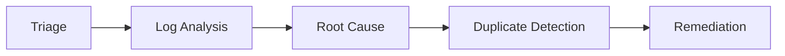

# AI Agents Documentation

## Agent Overview

The system uses 5 specialized AI agents orchestrated in a sequential pipeline:



## 1. Triage Agent

### Purpose
Classify the bug's severity, priority, category, and affected component.

### Input
- Bug title
- Description
- Stack trace (if available)
- Error logs (if available)
- Environment details

### Output
```json
{
  "severity": "critical|high|medium|low",
  "priority": "P0|P1|P2|P3",
  "category": "Null Reference|Memory Management|Concurrency|Network/IO|Logic Error",
  "component": "affected component name",
  "confidence": 0.85,
  "reasoning": "explanation of classification"
}
```

### Method
- Pattern matching on keywords and error types
- LLM classification with historical context
- Severity heuristics based on impact keywords

## 2. Log Analysis Agent

### Purpose
Parse and analyze error logs, stack traces, and exception patterns.

### Input
- Stack trace
- Error logs
- Bug description

### Output
```json
{
  "exceptions": [{"type": "...", "message": "...", "file": "...", "line": 0}],
  "stack_trace_analysis": "description of failure chain",
  "error_patterns": ["pattern1", "pattern2"],
  "suspicious_logs": ["log entry 1", "log entry 2"],
  "summary": "overall analysis"
}
```

### Method
- Regex-based exception extraction
- Stack trace parsing and chain analysis
- Pattern recognition for common error types
- LLM-powered log interpretation

## 3. Root Cause Agent

### Purpose
Identify the most probable root cause with supporting evidence.

### Input
- Bug data
- Triage results
- Log analysis results
- Historical similar bugs (via RAG)

### Output
```json
{
  "probable_cause": "detailed root cause description",
  "evidence": ["evidence 1", "evidence 2"],
  "confidence": 0.78,
  "related_components": ["component1", "component2"],
  "explanation": "causal chain explanation"
}
```

### Method
- RAG retrieval of similar historical defects
- LLM reasoning over retrieved context
- Causal chain analysis
- Evidence accumulation and confidence scoring

## 4. Duplicate Detection Agent

### Purpose
Detect potential duplicate bugs using semantic similarity.

### Input
- Bug title and description
- Category and component (from triage)

### Output
```json
{
  "is_duplicate": false,
  "similarity_score": 0.82,
  "duplicate_probability": 0.75,
  "matching_bugs": [{"bug_id": "...", "title": "...", "similarity": 0.82}],
  "analysis": "summary of findings"
}
```

### Method
- Embedding-based semantic search
- Cosine similarity scoring
- Threshold-based classification (> 0.85 = likely duplicate)
- Metadata comparison for additional signals

## 5. Remediation Agent

### Purpose
Suggest fixes, debugging steps, validation, and regression testing.

### Input
- Root cause analysis
- Triage results
- Historical resolutions (via RAG)

### Output
```json
{
  "suggested_fix": "detailed fix description",
  "debugging_steps": ["step1", "step2"],
  "validation_steps": ["step1", "step2"],
  "regression_tests": ["test1", "test2"],
  "estimated_effort": "2-4 hours",
  "risk_level": "low|medium|high"
}
```

### Method
- RAG retrieval of historical resolutions
- LLM synthesis of fix recommendations
- Best practices integration
- Effort estimation based on complexity

## Orchestration

The Agent Orchestrator:
1. Runs agents in sequence (some have dependencies)
2. Passes results between agents as context
3. Handles errors and timeouts
4. Collects timing metrics
5. Returns structured JSON with all results

### Execution Order
```
Triage (independent)
  ↓
Log Analysis (independent)
  ↓
Root Cause (depends on Triage + Log Analysis)
  ↓
Duplicate Detection (independent, uses RAG)
  ↓
Remediation (depends on Root Cause + Triage)
```
