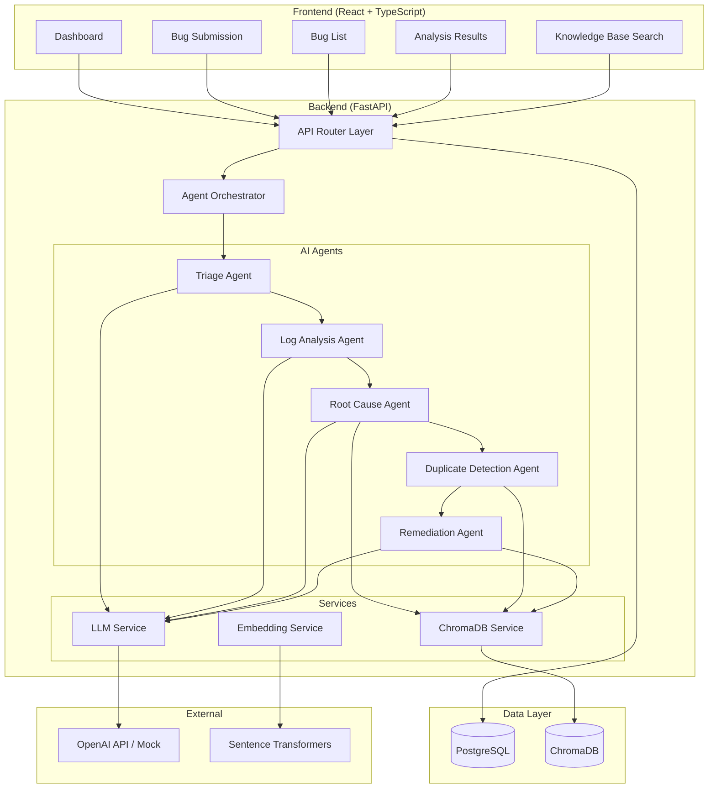

# System Architecture Documentation

## Overview

The AI-Based Software Defect Analysis System follows a modular architecture with clear separation of concerns across frontend, backend, data, and AI layers.

## Architecture Diagram (Mermaid)

## Component Responsibilities

### Frontend Layer
- **Dashboard**: Overview with stats and recent activity
- **Bug Submission**: Form with validation and file upload
- **Bug List**: Browse and manage submitted bugs
- **Analysis Results**: Display AI agent pipeline output
- **Knowledge Base**: Semantic search interface

### Backend Layer
- **API Router**: REST endpoints with validation
- **Agent Orchestrator**: Sequential pipeline execution
- **Services**: Business logic abstraction

### Data Layer
- **PostgreSQL**: Persistent storage for bugs and analysis
- **ChromaDB**: Vector storage for semantic search

## Data Flow

1. User submits bug via frontend form
2. Frontend validates and sends POST /api/bugs
3. Backend stores in PostgreSQL, returns Bug ID
4. User triggers analysis: POST /api/bugs/{id}/analyze
5. Orchestrator runs agents sequentially:
   - Triage → Log Analysis → Root Cause → Duplicate Detection → Remediation
6. Each agent may use RAG (ChromaDB) for historical context
7. Results stored in PostgreSQL and returned to frontend
8. Frontend displays structured analysis results

## Security Considerations

- CORS configuration for frontend-backend communication
- Input validation on all API endpoints
- File upload type restrictions
- API key management via environment variables
- No sensitive data in client-side code
